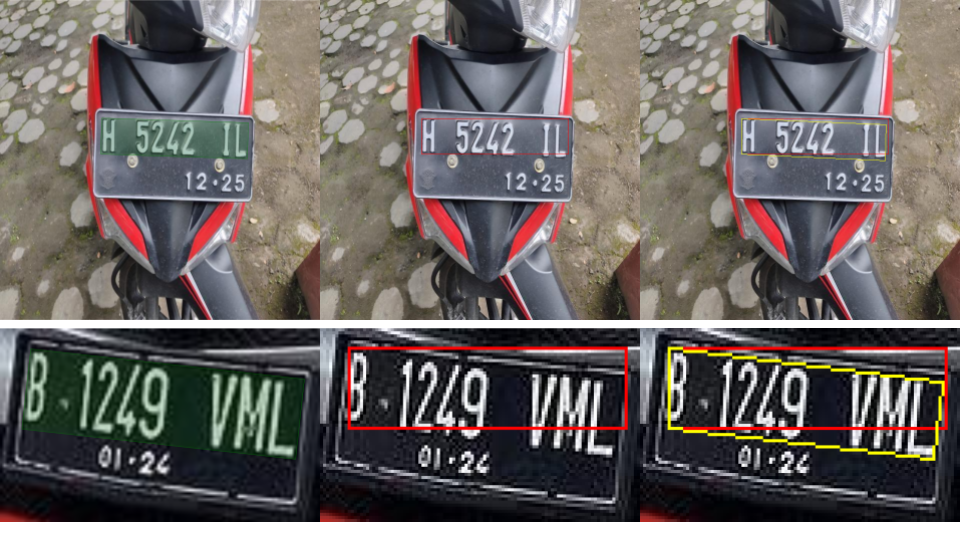
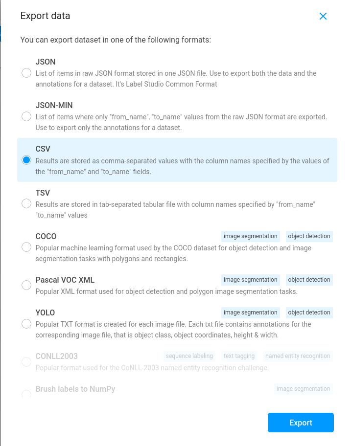

# label-studio-converter-for-YOLO-OBB

YOLO OBB is still new whereas still there are no bbox converter that yet available except the conversion from DOTAv1 dataset that is provided by Ultralytics

# INTRODUCTION
Widely opensource label annotation tool commonly used is [label studio](https://github.com/HumanSignal/label-studio). Therefore in this work will be based on the label studio. Moreover, i will run through the problem occurs in label studio when you have rotation attributes during the annotation process.

Moreover, the training process here is based on [Ultralytics](https://github.com/ultralytics/ultralytics) work

## PROBLEM
The different between YOLO and YOLO-OBB are not only the addition of the degree attribute but also the annotation format used during the training process. Ultralytics using this format.


YOLO
```
x_center, y_center, width, height
```

YOLO-OBB
```
class_index, x1, y1, x2, y2, x3, y3, x4, y4
```

When you are exporting the annotation results from label studio, you will get YOLO style annotation format above eventhough in your annotation has a degree. To the day this repo is launched, still there is no plan for the development of it. So, lets make it available to everyone!

Below shows 2 sets of images, in this case i am uing the Indonesian License Plate to better show you the degree problem that i mentioned



- *First column (Green bbox)*, is a label studio format where provided its canvas for you to annotate the width, height and certain angle of bbox.\
- *Second column (Red bbox)*, once you exported the provided YOLO Object Detection choice from label studio and plot it. This is the result that you will get.\
- *Third column (Yellow bbox)*, after running my script to recalculate the angle given in the label studio metadata

# HOW TO USE?
First of all, this script is based on the label studio using template OCR. Usually when you create the first project, the label studio will ask you which kind of template that you will follow. Here are the steps:
1. Export the CSV format kind of style. I provided the example of CSV that i exported from label studio. *please check `test.csv`* \


2. run the yolo_obb_converter.py \
Notes : Due to this script is still flexible, you might have a different annotation header label in your label studio. Therefore, i am providing the script only (without pip). \
There are 2 header columns that this script is interested in: *label* and *ocr*. \
inside the header label will extract the bbox details include the labels of your object detection task. For the file name, you will extract from the ocr header. Each images will have corresponding .txt just like other YOLO format. 

